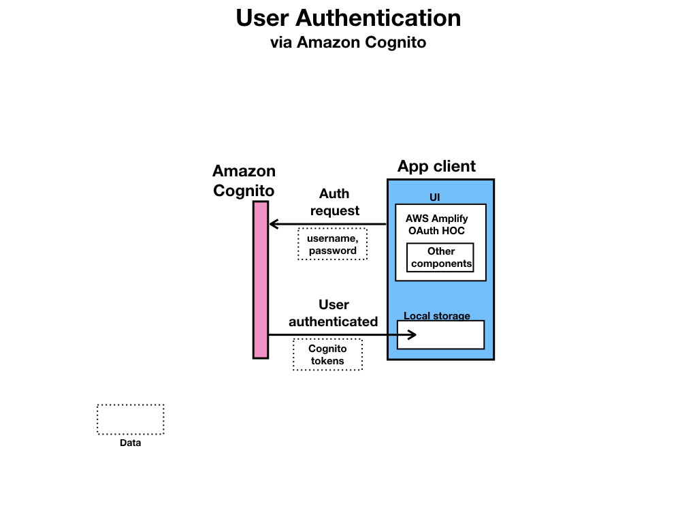
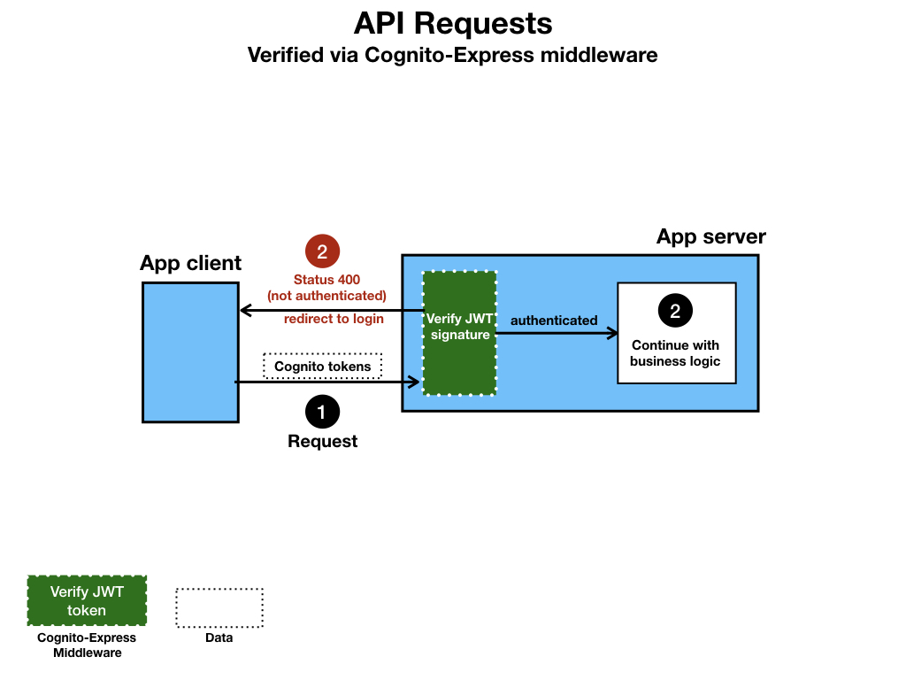
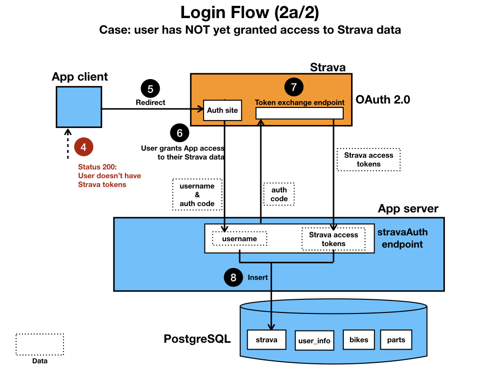
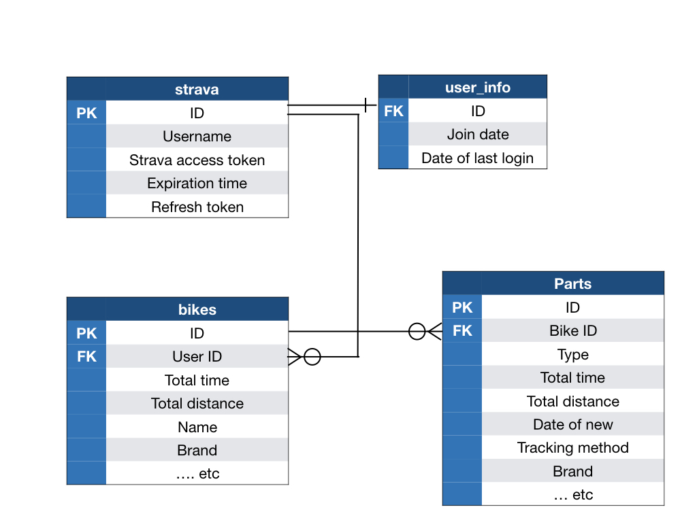

# About BikeBikeBike
BikeBikeBike is a full-stack app tracks wear on bicycle components by pulling in a user's ride data (miles and hours) for 
each of the user's bikes from [Strava](http://strava.com). Users create a BikeBikeBike account, sign in to their Strava account
and grant BikeBikeBike permissions via OAuth 2.0, which allows the BikeBikeBike to make requests to [Strava](http://strava.com)'s API on the user's behalf.

For each bike the user has added to their [Strava](http://strava.com) account, the user can add components and specify how they want to track wear (via
distance, ride time or date). The user can opt for a default specification based on the type of component or customize the lifespan/service
interval. The UI displays a summary of the user's bikes with a quick visual representation of how much wear each part
has incurred. The user can view more detailed info about each bike's parts, and choose to modify the tracking metrics. The user can
retire a component for consumable parts, such as chains, or indicate that the part has been serviced, as in the case of freehubs, 
shocks or batteries.

NB This app's name, BikeBikeBike, is in flux :)

  
## Built With
| Tech              | Role                           |
|-------------------|--------------------------------|
| React             | UI                             |
| Redux             | State management               |
| React\-Boostrap   | Styling components             |
| vanilla Bootstrap | Responsive styling             |
| vanilla CSS       | Styling                        |
| Webpack           | Bundler                        |
| Babel             | JSX transpiler                 |
| AWS Amplify       | Auth platform, user management |
| Amazon Cognito    | Secure back end resources      |
| Cognito\-Express  | User verification middleware   |
| Postgres          | SQL database management        |
| Node\.js          | JS runtime env                 |
| Express           | Server framework               |
| npm               | Package management             |

  
## High-level App Flow

__________________________

__________________________

__________________________

__________________________

__________________________

  
## SQL Schema

  

  
## Insights
This project has been teaching me that I don't need to reinvent the wheel. This is the first app I built using 3-party authentication. I originally started building the backend with the idea that I would implement auth from scratch ([abandoned repo](https://github.com/nicolemunoz99/gear-love)). No only is does the UI require authentication for access, but the database is fully protected through using Cognito-Express middleware to verify the authenticity of the user's request. The API endpoints containing user data require a user account, and that account can only access its own resources.

The [form for adding a new component](https://github.com/nicolemunoz99/bikebikebike/blob/master/client/src/components/wrappers/partForm/Index.jsx) was probably the most time-consuming part of the project. The sub-components that the form displays are based on previous selections from the user. In order to speed up the UI dev process, I chose to keep state of the controlled form in the Redux store. This allowed me to take advantage of Redux browser dev tools and pin state while building the form's sub-components, instead of constantly having to click through the app to return the form's state prior to the app refreshing.

In the spirit of not 'reiventing the wheel', I looked into 3rd-party libraries for form verification. However, given the conditional complexity of this form (e.g., required fields for lifespan metrics depended on the user's previous selection of what metrics they wanted to use), I couldn't find a library that suited my needs. Consequently, this was the most complex form verification I built out. However, given my passion for bikes and the features I thought were necessary to make the app useful, I'm extremely happy with the outcome.

I also used React-Bootstrap for the first time here, which I really like. It hugely improves readability and, for me, speeds up building out components.

Another feature of this app that added just a touch more challenge was the distance units that the user prefers. I pulled in the user's preference for miles vs kilometers from Strava. Several places throughout the app, I needed to render the unit, and there was a lot of repetition of pulling in this unit and the wear for each component, that I finally saw my first opportunity to create a [custom React hook](https://github.com/nicolemunoz99/bikebikebike/blob/master/client/src/hooks/useMetricOptions.js).

There are some more features I want to build. For example, I want the user to be able to pull in the service history for a component. This will require add a 'services' table to my SQL schema. Stay tuned. 
