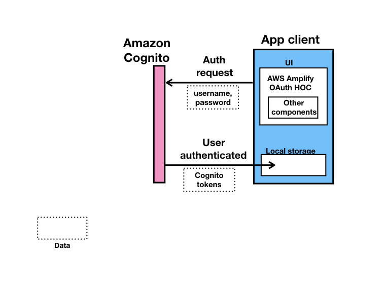
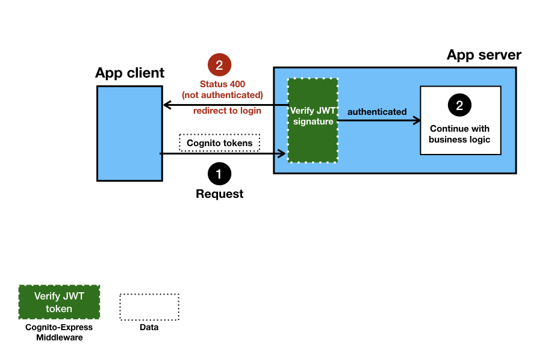
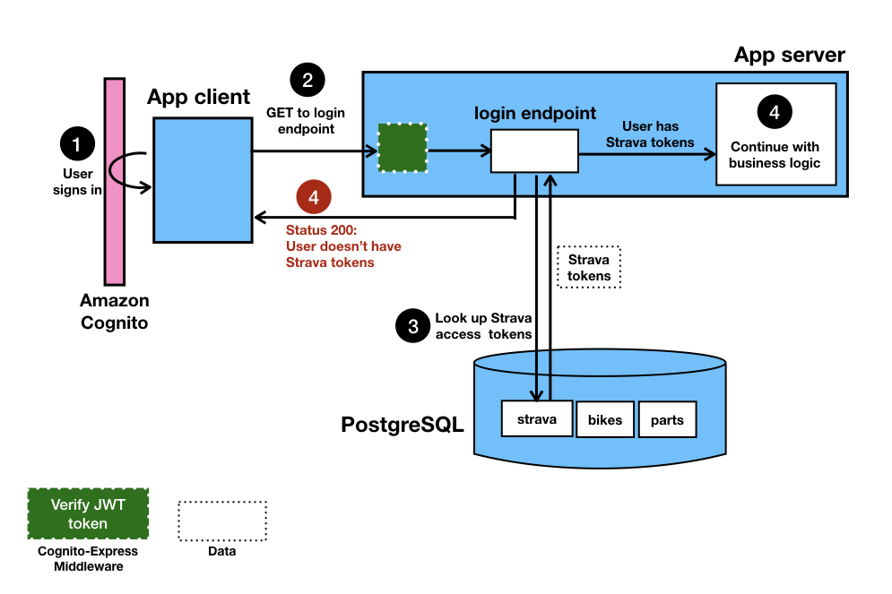
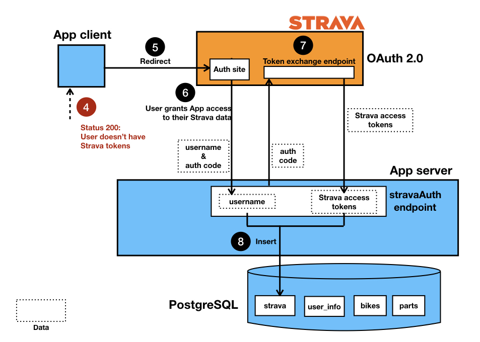
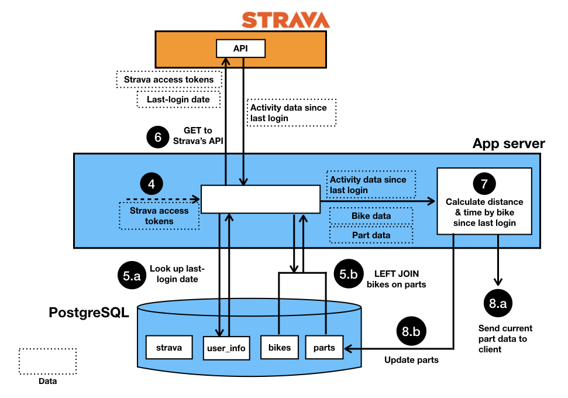

# High-level App Flow

* [User auth with Amazon Cognito](/#auth-with-amazon-cognito)
* [Protected API requests](/#protected-api-requests)
* [User login](/#user-login)
  * [Case: Strava permissions NOT yet granted](/#no-permissions)
  * [Case: User has granted BikeBikeBike access to Strava data](/#permissions-granted)

***

## Auth with Amazon Cognito

***

## Protected API requests

***

## User login

### Check if user has granted Strava permissions

***

### Case:

### No permissions

***

### Case:

### Permissions granted

