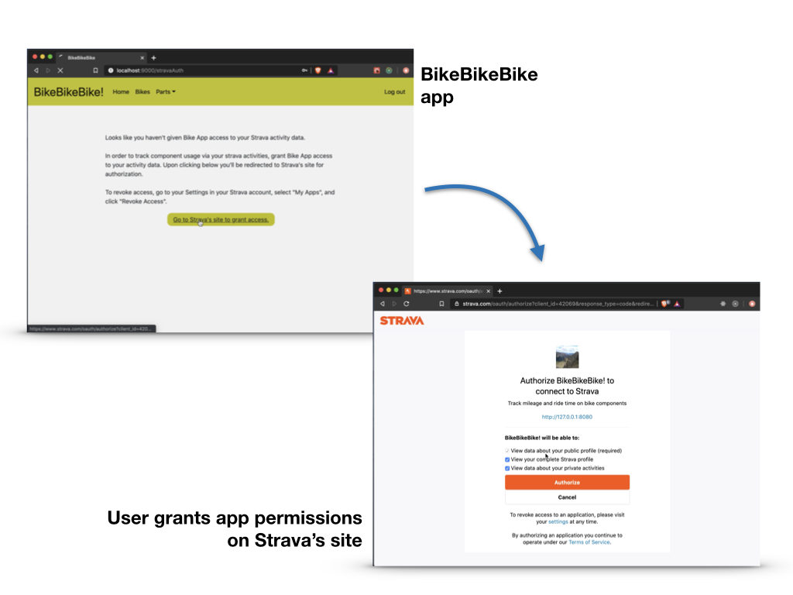
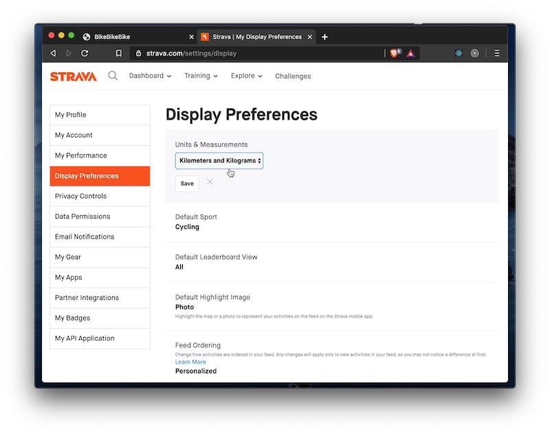
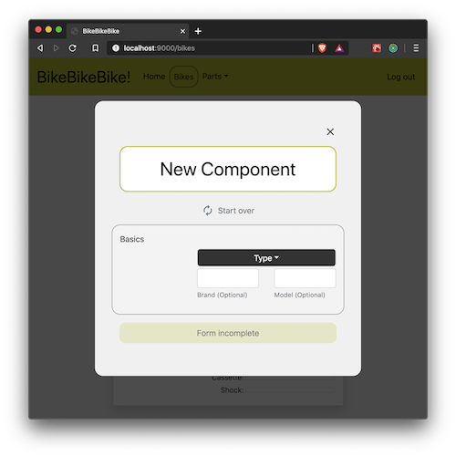
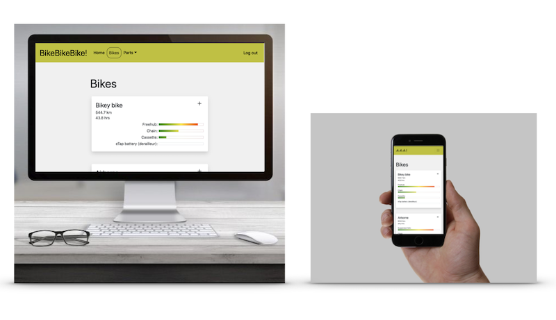
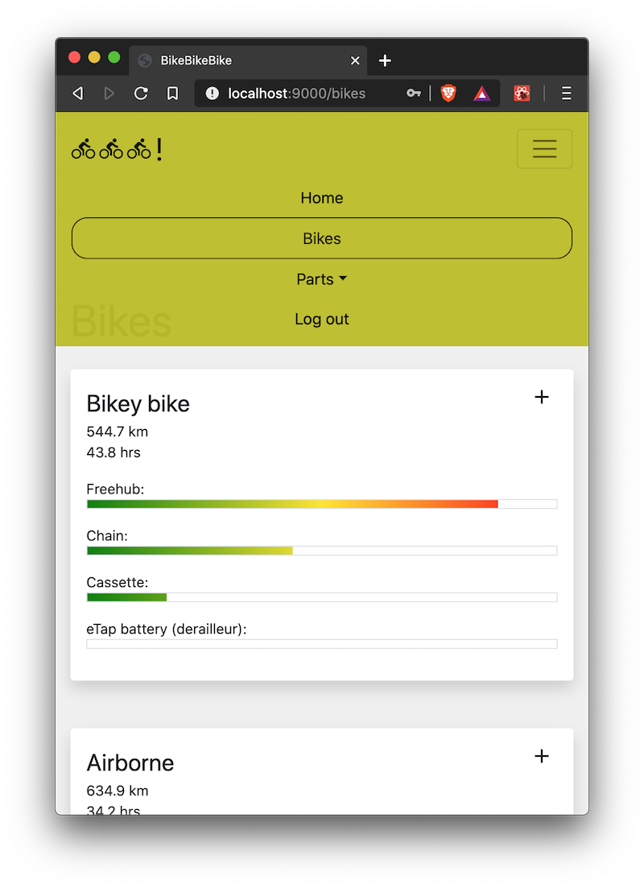
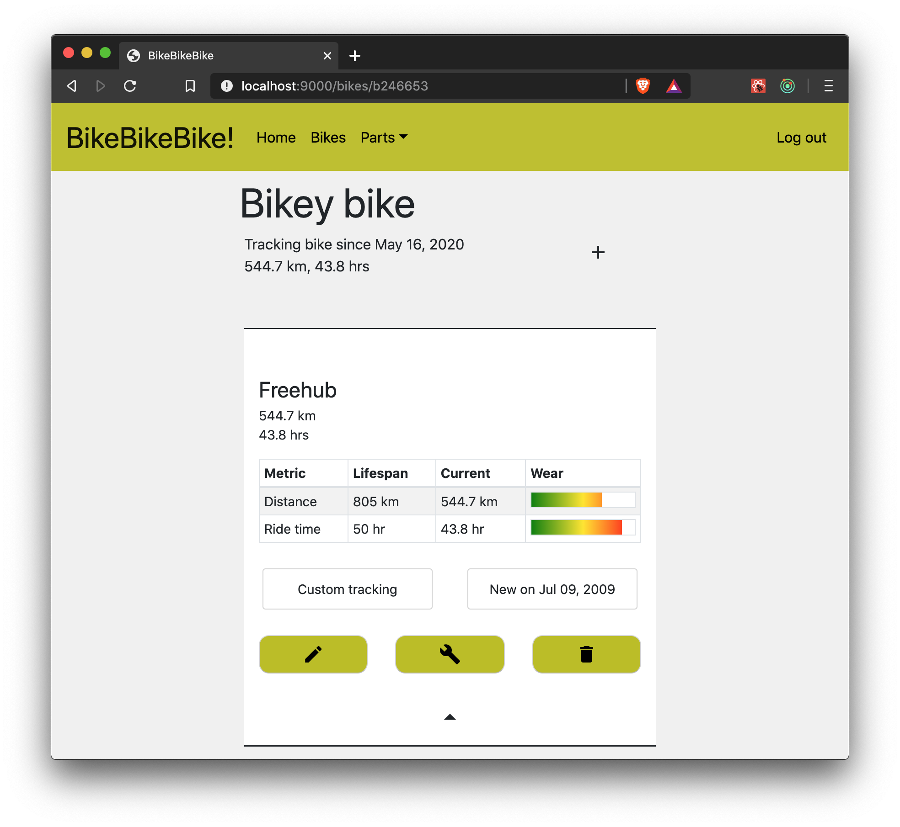
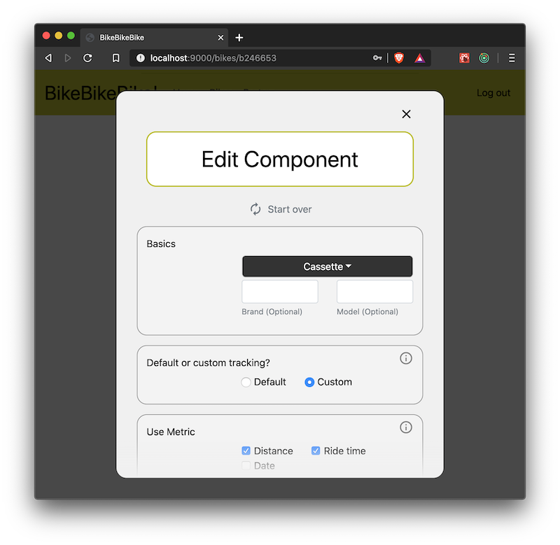

# Video demos

* [Strava OAuth 2 integration](#strava-oauth-2-integration)
* [Strava API integration](#strava-api-integration)
* [Add bike parts](#add-bike-parts)
* [Responsive UI](#responsive)
* [React-Router & navigation](#react-router-and-navigation)
* [Expandable part-details module](#expandable-part-details-module)
* [Form with validation](/videos.md/#form-with-validation)

***

## Strava OAuth 2 integration

[OAuth2 Integration ](https://youtu.be/R9f51W66fNI)

***

## Strava API integration

[Demo of app reading in user's preferences from Strava ](https://youtu.be/tBC8-BTQE48)

***

## Add bike parts

[How to add parts ](https://youtu.be/-B5IWsg2mbg)

***

## Responsive

[See responsive UI on video ](https://youtu.be/O84G882jWS8)

***

## React-Router and navigation

[Video of app navigation ](https://youtu.be/ObAzk5CTv7I)

***

## Expandable part-details module

[Interaction with part-details module ](https://youtu.be/BvhGEQabce0)

***

# Form with validation

[Add and Edit part form ](https://youtu.be/VgPFyAc4T9E)